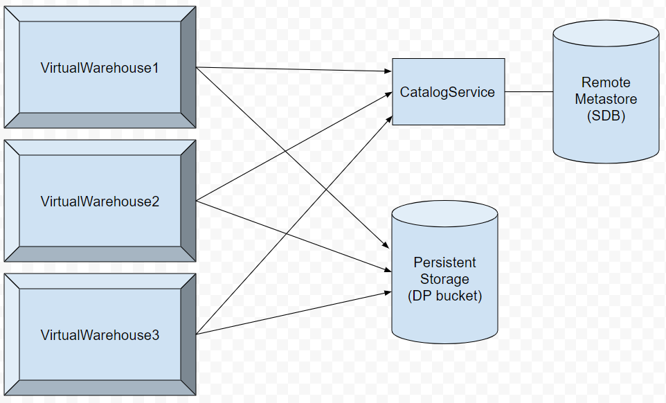
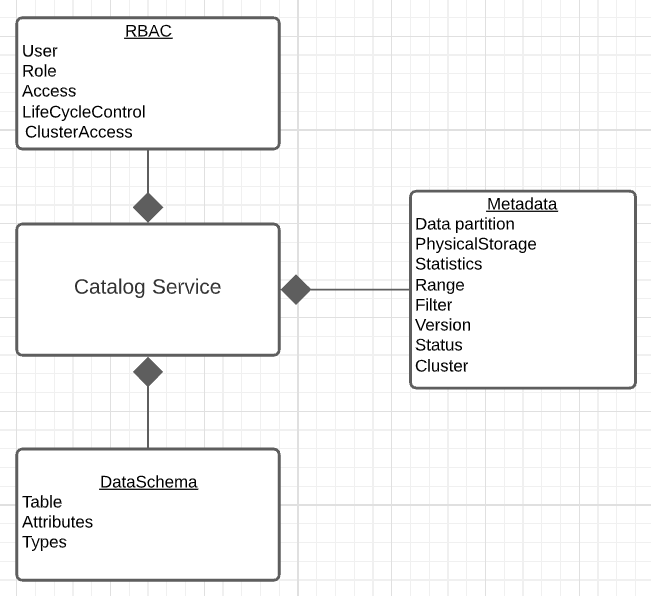
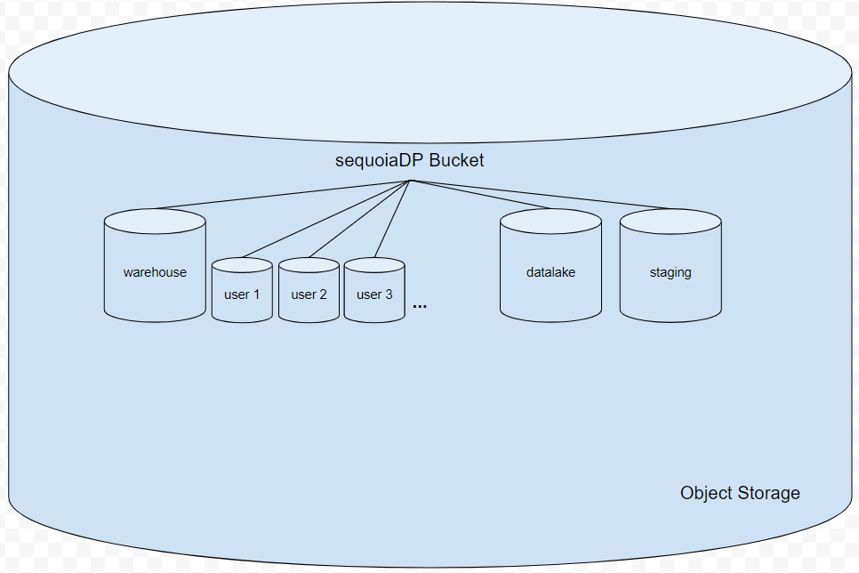
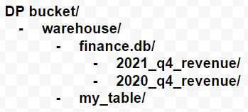
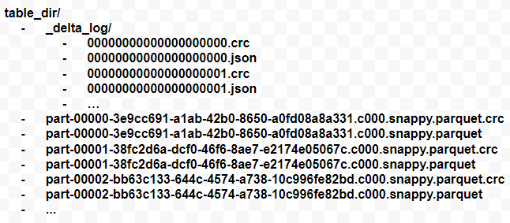
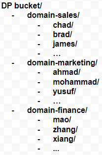
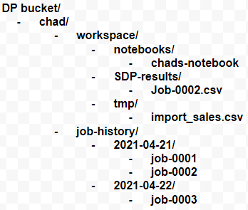
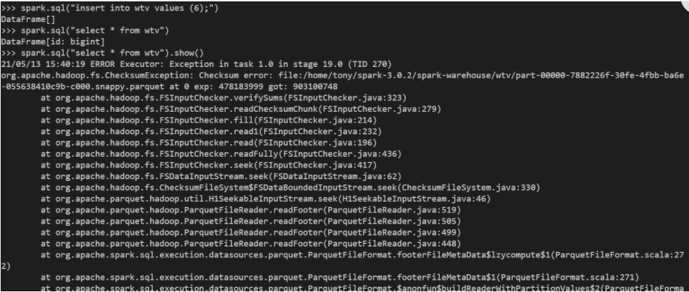
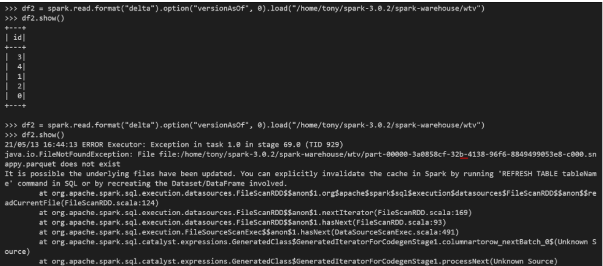

**DP Storage Architecture**

Story- Storage Architecture

\*

|                      |      |
|----------------------|------|
| Revision record      |      |
| 2021-04-22 Tony Chen | Init |
|                      |      |

**Story编号和名称(Story Number and name)**

Storage architecture for SequoiaDP

**Story价值和功能介绍(Story value and function description)**

说明: 简单描述Story
对于客户的价值,使用客户(如应用程序开发人员/维护人员,或者内部技术服务人员)

This will detail the storage architecture for each SequoiaDP deployment.

**Story 对外功能接口描述(Story external interface description)**

说明: 简单描述Story 的对外接口,包括命令行/界面,
客户可见配置文件的参数描述;

**Story约束和依赖(Story restriction and dependency)**

说明：简单描述Story对其它功能的约束，以及对某些功能的依赖

**Story 简单设计(Story high level design)**

**相关模块架构图(Related module architecture)**

**Metastore**



There will be one remote metastore accessible by all clusters to persist
table metadata.

**Catalog Service**



The catalog service will handle RBAC, Metadata, and Schemas.

**SequoiaDP Bucket (Persistent Object Storage)**



One bucket per SequoiaDP deployment. We can deploy our own bucket or let
the user provide their own bucket. The naming convention for the bucket
will be SequoiaDP-HashValue or a user provided name.

/warehouse – contains all database directories and table data.

/datalake – contains raw, unstructured data.

/staging – staging area that contains data being processed (e.g.
intermediate data when

performing ETL on datalake to warehouse)

~~/domains – contains related users that belong to the domain (similar
to a group)~~

**warehouse directory**

All tables will be managed meaning users cannot specify a custom
location for table or database data. All database directories will
reside in the warehouse directory. Table directories will be stored
under their corresponding database directory with the exception being
tables of the default database which will be stored under the warehouse
directory.

To specify the location of the warehouse directory we can use the Spark
“spark.sql.warehouse.dir” configuration setting.

We will use the default Spark naming convention for database and table
directories:

Database directory naming convention: &lt;database\_name&gt;.db

Table directory naming convention: &lt;table\_name&gt;

E.g. sample warehouse directory



**Table directory**

We are only allowing creation of Delta tables. For delta tables, a
“\_delta\_log” directory that contains the delta log json files will be
created under the table directory. If the table is not partitioned by a
column, then the table data will be placed directly under the table
directory. If the table was partitioned by a column, then there will be
a directory for each partition containing the table data.

Table data files will be stored in parquet format. All table data and
delta log file will have a corresponding checksum file. By default Spark
does not create a corresponding checksum file with each delta log json
file.

We will use the default Spark naming convention for these files.

E.g. sample table directory



**~~Domain directory~~**

~~An administrator can create domains which act as a group to place
related users together.~~

~~The domain directory will contain the user home directories that are
part of the domain.~~

~~Naming convention of each domain directory:
domain-&lt;domain-name&gt;~~

~~e.g. sample domain directories.~~

Depending on future decisions like whether we allow a user to belong to
multiple domains, this is going to be taken out for now.



**User directory**

The name of the user directories will simply be the name of the user.
Usernames must be unique in a SequoiaDP deployment.

Directories under each user directory:

./workspace – contains users workspace objects (e.g. notebooks) that are
accessible through the browser (requires user credential)

E.g. to access /domain/user/workspace/chadsData.csv use
[https://&lt;SequoiaDP-BucketName&gt;/user/workspace/chadsData.csv](#null)

./notebooks – contains saved user notebooks

./SDP-results – files generated by saving the full results of a query

./tmp -  a temporary directory that contains the files that you upload
and other data files from your local desktop to process on SequoiaDP
(e.g. CSV files)

./job-history - history of job results

Grouped by the date the job was executed

Identified by the job id

Support user configured file pruning

e.g. sample user directory

  

**Current Stand-alone Spark Fault detection/tolerance (checksum files)**

Spark does provide corruption detection on parquet data files.  
After manually altering the parquet file, trying to read from the table returns a checksum error. Note that the exception is only raised when you try to actually try to use the data frame (for example doing a show() on the DF). Insert operations on the table however have no problem.



Delta Lake does not use the delta log checksum files currently to provide corruption detection.  
After manually altering the delta log file, trying to use the time travel feature provided by Delta Lake, Spark will not report any signs of corruption. It just attempts to read the delta log. There will only be an error if I alter a part of the delta log that Spark actually uses. For example, changing a file path name in the delta log.



**Spark and Delta Lake Fault detection/tolerance (checksum files)**

**Step 1: Enable crc files for delta log and table data files**
Delta lake already provides apis for writing checksum files in the Checksum.scala file (writeChecksumFile() method in RecordChecksum trait). 

The writeChecksumFile() method takes in a Snapshot object which is described as:

'''
An immutable snapshot of the state of the log at some delta version. Internally
this class manages the replay of actions stored in checkpoint or delta files.
After resolving any new actions, it caches the result and collects the
following basic information to the driver:
 - Protocol Version
 - Metadata
 - Transaction state
'''

There are two places where delta logs are committed:

1. OptimisticTransaction.scala (doCommit() method)

New commits to the transaction log are handled here with optimistic concurrency control. After the log is written:
```scala
deltaLog.store.write(
      deltaFile(deltaLog.logPath, attemptVersion),
      actions.map(_.json).toIterator)
```

And an updated snapshot is retrieved:
```scala
val postCommitSnapshot = deltaLog.update()
```

A call to writeChecksumFile() is made by passing in postCommitSnapshot

2. DeltaCommand.scala (commitLarge() method)
This method is is typically used to create new tables (e.g. CONVERT TO DELTA) or 
apply some commands which rarely receive other transactions (e.g. LONE/RESTORE).

This commit to the transaction log does not use optimistic concurrency control. If it fails 
to commit the specified version of the log, it will fail and not retry.

After the log is written:
```scala
deltaLog.store.write(deltaFile(deltaLog.logPath, attemptVersion), allActions.map(_.json))
```
A checkpoint will be written:
```scala
updateAndCheckpoint(spark, deltaLog, commitSize, attemptVersion)
```
Inside this call an updated snapshot is retrieved:
```scala
val currentSnapshot = deltaLog.update()
```
A call to writeChecksumFile() is made by passing in currentSnapshot

PR: https://gitlab.torlab/sequoiadp/delta/-/merge_requests/1


**Step 2: When/how we use these CRCs to detect corruption**

**Step 3: If we detect corruption, what do we do?**

**主要操作流程(Main operation flow)**

说明: 使用时序图或者活动图,描述一下主要流程的处理过程

**相关资料设计(Related materials)**

说明: 设计资料的章节、展示形容和内容概要

<https://docs.databricks.com/>- databricks was used as a reference point

**进度评估跟踪(Progress tracking and estimation)**

\*

|                  |                                  |     |                  |                           |     |
|------------------|----------------------------------|-----|------------------|---------------------------|-----|
| 汇总信息         |                                  |     |                  |                           |     |
| 总工作量（KLOC） |                                  |     | 开发周期（人天） |                           |     |
| 开始时间         |                                  |     | 结束时间         |                           |     |
| 周计划           |                                  |     |                  |                           |     |
| 时间（第X周）    | 计划                             |     |                  | 完成情况                  |     |
| 第一周           | *编码完成Coord向Catalog注册*     |     |                  | *按时完成*                |     |
| 第二周           | *编码完成会话机制并实现全面对接* |     |                  | *延迟1天，对下阶段不影响* |     |
| 第三周           | *自测并提交测试验收*             |     |                  | *按时完成*                |     |
| 第X周            |                                  |     |                  |                           |     |

**遗留问题(Left over issues)**

说明：该特性中暂时未彻底解决或有待改进优化的问题

\*

|          |          |          |
|----------|----------|----------|
| **编号** | **标题** | **描述** |
|          |          |          |

**验收测试用例(Acceptance testcases)**

说明: 验收用例是用于表明开发基本功能OK,
满足启动测试最基本需要的一组用例.
验收用例通过,表明开发完成,可启动正式测试;

\*

<table>
<tbody>
<tr class="odd">
<td><strong>用例编号</strong></td>
<td><strong>用例名称</strong></td>
<td><strong>用例操作步骤</strong></td>
<td><strong>期望结果</strong></td>
</tr>
<tr class="even">
<td>Story.uniondb.mgr.001.001</td>
<td>创建DB2 数据源和表,查询DB2数据表</td>
<td><p>添加DB2 数据源</p>
<p>创建表….</p></td>
<td>查询结果与预期相同</td>
</tr>
<tr class="odd">
<td></td>
<td></td>
<td></td>
<td></td>
</tr>
</tbody>
</table>

**Checklist**

\*

<table>
<tbody>
<tr class="odd">
<td>检查项</td>
<td><p>结论</p>
<p>（NA/N/Y）</p></td>
<td>备注</td>
</tr>
<tr class="even">
<td>代码是否全部提交SVN，且符合代码规范</td>
<td></td>
<td></td>
</tr>
<tr class="odd">
<td>原有用例是否全部通过</td>
<td></td>
<td></td>
</tr>
<tr class="even">
<td>Story文档是否更新</td>
<td></td>
<td></td>
</tr>
<tr class="odd">
<td>验收用例是否全部通过</td>
<td></td>
<td></td>
</tr>
<tr class="even">
<td>资料是否变更</td>
<td></td>
<td></td>
</tr>
<tr class="odd">
<td>接口和设计是否通过评审</td>
<td></td>
<td></td>
</tr>
<tr class="even">
<td>相关驱动是否变更或添加</td>
<td></td>
<td></td>
</tr>
<tr class="odd">
<td>周边关联产品或模块是否通知</td>
<td></td>
<td></td>
</tr>
<tr class="even">
<td>sdb shell帮助信息是否更新</td>
<td></td>
<td></td>
</tr>
</tbody>
</table>
