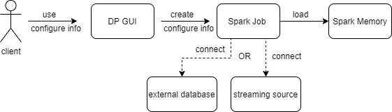

**Data ingestion to Spark From Database and Stream**

**Data Ingestion to Spark From Database and Stream**

Data ingestion to Spark From Relational Database and Stream

\*

|                     |      |
|---------------------|------|
| Revision record     |      |
| 2021/04/06 Ben Wang | Init |
|                     |      |

**Story编号和名称(Story Number and name)**

Data ingestion to spark

**Story价值和功能介绍(Story value and function description)**

说明: 简单描述Story
对于客户的价值,使用客户(如应用程序开发人员/维护人员,或者内部技术服务人员)

Clients can use data from their existing database, and are able to take
in data from the streaming data services.

**Story 对外功能接口描述(Story external interface description)**

说明: 简单描述Story 的对外接口,包括命令行/界面,
客户可见配置文件的参数描述;

For client, everything can be configured via the seqiouaDP GUI. By
selecting the type of input and providing the input address.

For example:

For the external database, it will require the type of database, user
certificate, tablename, maybe schema and columns.

For the streaming services, it will require the type of streaming
service and address for the pipe.

**Story约束和依赖(Story restriction and dependency)**

说明：简单描述Story对其它功能的约束，以及对某些功能的依赖

External database will be dependent on the JDBC support, this list shows
the supported databases by industry:[JDBC Industry
Support](https://www.oracle.com/java/technologies/industry-support.html)

Streaming services requires lost of cores to keep up with the input
speed

Streaming services naturally require large amounts of data storage. That
may limit how we want to set up the memory module

Streaming batch size needs to be tested and set to the proper size

**Story 简单设计(Story high level design)**

**相关模块架构图(Related module architecture)**

说明: 简单的绘制以下与该Story 相关的模块, 特别是新增模块;

GUI -&gt; connection type, connection address -&gt; spark -&gt; load
-&gt;spark memory

**主要操作流程(Main operation flow)**

说明: 使用时序图或者活动图,描述一下主要流程的处理过程

When input streams from network the data are replicate to two nodes for
fault-tolerance by default and Dstreams keeps data serialized in memory.

Streamed in data is processed in batches, once a batch is processed it
can clear out from memory.

Fault tolerance with checkpointing: both metadata and data are
checkpointed

**Fault talerance sematics**:

Depending on the different parts of processing steps:

Receving part:

Receives with file: exactly once semantic.

Receives with revicer-based resource: at-least-once guarantee.

With Kafka, it can be achieved exactly once semantic.

Output part:

It has at-least-once guarantee, but with further efforts, it can achieve
exactly-once sematic.

With the following two approaches: Idempotent updates or Transactional
updates

**相关资料设计(Related materials)**

说明: 设计资料的章节、展示形容和内容概要

<https://spark.apache.org/docs/latest/sql-data-sources-jdbc.html>

<https://www.oracle.com/java/technologies/industry-support.html>

<https://spark.apache.org/docs/latest/streaming-programming-guide.html>

**进度评估跟踪(Progress tracking and estimation)**

\*

|                  |                                  |     |                  |                           |     |
|------------------|----------------------------------|-----|------------------|---------------------------|-----|
| 汇总信息         |                                  |     |                  |                           |     |
| 总工作量（KLOC） |                                  |     | 开发周期（人天） |                           |     |
| 开始时间         |                                  |     | 结束时间         |                           |     |
| 周计划           |                                  |     |                  |                           |     |
| 时间（第X周）    | 计划                             |     |                  | 完成情况                  |     |
| 第一周           | *编码完成Coord向Catalog注册*     |     |                  | *按时完成*                |     |
| 第二周           | *编码完成会话机制并实现全面对接* |     |                  | *延迟1天，对下阶段不影响* |     |
| 第三周           | *自测并提交测试验收*             |     |                  | *按时完成*                |     |
| 第X周            |                                  |     |                  |                           |     |

**遗留问题(Left over issues)**

说明：该特性中暂时未彻底解决或有待改进优化的问题

\*

|          |          |          |
|----------|----------|----------|
| **编号** | **标题** | **描述** |
|          |          |          |

**验收测试用例(Acceptance testcases)**

说明: 验收用例是用于表明开发基本功能OK,
满足启动测试最基本需要的一组用例.
验收用例通过,表明开发完成,可启动正式测试;

\*

<table>
<tbody>
<tr class="odd">
<td><strong>用例编号</strong></td>
<td><strong>用例名称</strong></td>
<td><strong>用例操作步骤</strong></td>
<td><strong>期望结果</strong></td>
</tr>
<tr class="even">
<td>Story.uniondb.mgr.001.001</td>
<td>创建DB2 数据源和表,查询DB2数据表</td>
<td>
添加DB2 数据源

创建表….
</td>
<td>查询结果与预期相同</td>
</tr>
<tr class="odd">
<td></td>
<td></td>
<td></td>
<td></td>
</tr>
</tbody>
</table>

**Checklist**

\*

<table>
<tbody>
<tr class="odd">
<td>检查项</td>
<td>
结论

（NA/N/Y）
</td>
<td>备注</td>
</tr>
<tr class="even">
<td>代码是否全部提交SVN，且符合代码规范</td>
<td></td>
<td></td>
</tr>
<tr class="odd">
<td>原有用例是否全部通过</td>
<td></td>
<td></td>
</tr>
<tr class="even">
<td>Story文档是否更新</td>
<td></td>
<td></td>
</tr>
<tr class="odd">
<td>验收用例是否全部通过</td>
<td></td>
<td></td>
</tr>
<tr class="even">
<td>资料是否变更</td>
<td></td>
<td></td>
</tr>
<tr class="odd">
<td>接口和设计是否通过评审</td>
<td></td>
<td></td>
</tr>
<tr class="even">
<td>相关驱动是否变更或添加</td>
<td></td>
<td></td>
</tr>
<tr class="odd">
<td>周边关联产品或模块是否通知</td>
<td></td>
<td></td>
</tr>
<tr class="even">
<td>sdb shell帮助信息是否更新</td>
<td></td>
<td></td>
</tr>
</tbody>
</table>
