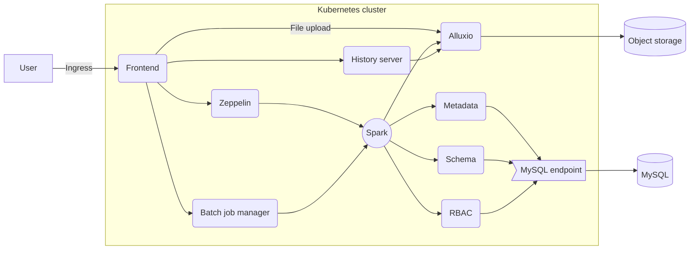

```mermaid
flowchart LR
  user[User]
  s3[(Object storage)]
  rds[(MySQL)]
  user --> |Ingress| frontend

  subgraph Kubernetes cluster
    %% Services
    frontend(Frontend)
    zeppelin(Zeppelin)
    alluxio(Alluxio)
    metadata(Metadata)
    history(History server)
    batch(Batch job manager)
    schema(Schema)
    rbac(RBAC)
    db>MySQL endpoint]

    %% Jobs
    spark((Spark))

    %% Connections
    frontend --> zeppelin & history & batch
    frontend --> |File upload| alluxio
    zeppelin & batch --> spark
    spark --> alluxio & metadata & schema & rbac
    history --> alluxio
    metadata & schema & rbac --> db
  end

  db --> rds
  alluxio  ---> s3

```
