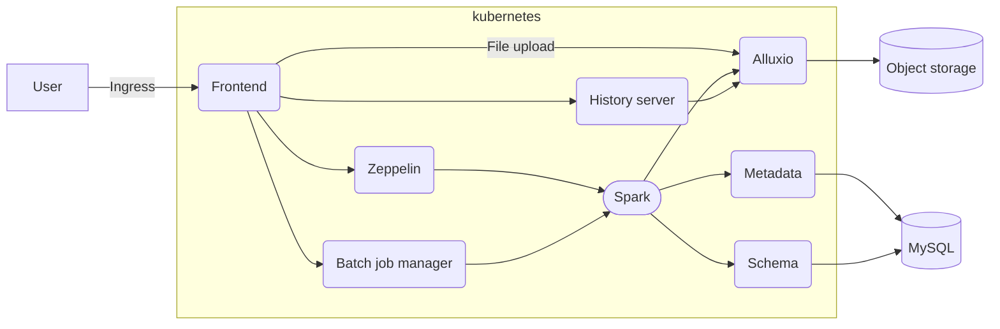

```mermaid
flowchart LR
  user[User]
  s3[(Object storage)]
  db[(MySQL)]
  user --> |Ingress| frontend

  subgraph kubernetes
    %% Services
    frontend(Frontend)
    zeppelin(Zeppelin)
    alluxio(Alluxio)
    metadata(Metadata)
    history(History server)
    batch(Batch job manager)
    schema(Schema)

    %% Jobs
    spark([Spark])

    frontend --> zeppelin & history & batch
    frontend --> |File upload| alluxio
    zeppelin & batch --> spark
    spark --> alluxio & metadata & schema
    history --> alluxio
  end

  alluxio  --> s3
  metadata & schema --> db
```
