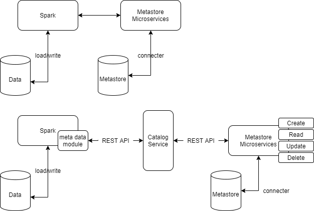

**Spark external metastore**

Metastore

\*

|                     |        |
|---------------------|--------|
| Revision record     |        |
| 2021/04/12 Ben Wang | Init   |
| 2021/4/23 Ben Wang  | Second |

**Story编号和名称(Story Number and name)**

Meta Store for parquet files used by spark

**Story价值和功能介绍(Story value and function description)**

说明: 简单描述Story
对于客户的价值,使用客户(如应用程序开发人员/维护人员,或者内部技术服务人员)

Instead of store the parquet metadata in the footer of parquet, store
them to a dedicated metastore. Reduce the time required for spark to
fetch the meta data. Reference to Celvin’s experiment there are
performance improvement.

**Story 对外功能接口描述(Story external interface description)**

说明: 简单描述Story 的对外接口,包括命令行/界面,
客户可见配置文件的参数描述;

There should no external interface to the clients, it should be internal
use when we store data from a spark application. When a Spark
application pull data from the database we have, there should be a call
to the metastore, to fetch the meta data information. When a Spark
applcaitoin push data to our datastore, a call will be made to the
metastore to update the meta data information. This is should be
transparent to client, they will not need to do anything.

**Story约束和依赖(Story restriction and dependency)**

说明：简单描述Story对其它功能的约束，以及对某些功能的依赖

It requires microservices to communicate to the metastore. Microservice
maybe a bottleneck for the process.

**Story 简单设计(Story high level design)**

**相关模块架构图(Related module architecture)**

说明: 简单的绘制一下与该Story 相关的模块, 特别是新增模块;

**主要操作流程(Main operation flow)**

说明: 使用时序图或者活动图,描述一下主要流程的处理过程

When a spark job is load or write to the data store, a response is sent
to Catalog service, Catalog service will handle the Access control and
authentication required by the system, then hand over the request to
metastore microservice, then the microservice is going to forward the
message to the metastore to fetch the metadata information.

Therefore the task can be divided to 3 components: spark meta store
access function, microservice, and the metastore. We need to handle the
process from spark to microservice,

Microservice to metastore.

Our initial plan for spark-microservice communication is using REST
APIs, microservice-metastore communication is using database driver.

**Microservice:**

Microservice gives the REST API to do CRUD (Create, Read, Update,
Delete) operations to the metastore. In our case, Spark will talk to the
Catalog service, Catalog service will handle the authentication, access
privilege and other preconditions/requirements. Then the request will
pass to the metadata microservice. Metadata microservice will take over
the request body, then send CRUD request to metastore accordingly. Since
we are planning to deploy the metastore with a nosql database, we don't
need to create anything to parse the metadata.

REST API url should be formatted like this:

catalog\_service\_address/metastore/&lt;action&gt;/&lt;file
type&gt;/&lt;service\_name&gt;/{parameters}

**CREATE:**

A POST request will be performed. Since we have all table schema
pre-defined, we will not support crcreate a new table from the REST API.
CREATE function will work on adding new records to the database.
Microservice will take the request body and insert it into the database

Insert Parquet metadata:

/metastore/create/parquet/metadata

Request body: file metadata

**READ:**

A GET request will be performed. Microservice will query the
corresponding file metadata and send it back. More read APIs need to be
designed.

Read Parquet metadata by file name:

catalog\_service\_address/metastore/read/parquet/metadata

Parameter: file, subFile

Read Parquet Row count by file name:

catalog\_service\_address/metastore/read/parquet/row\_count

Parameter: file, subFile

Read Parquet SizePerFile by file name:

catalog\_service\_address/metastore/read/parquet/size\_per\_file

Parameter: file

**Update:**

Parquet files will not be mutatable, its metadata should not be updated.

**Delete**

A DELETE request will be performed. Everything related to the file\_id
will be deleted from metastore.

Remove Parquet metadata by file name:

catalog\_service\_address/metastore/read/parquet/metadata

Parameter: file

**Response body structure design:**

Currently using JSON as type of data that send over for REST API, BSON
as the data send to the backend database, for reference, the
microservice is using the following structure to process the data:

    type ParquetMetadata struct {
        File     string         `json:"file" bson:"file"`
        Filesize int            `json:"fileSize" bson:"fileSize"`
        Metadata MetadataStruct `json:"metaData" bson:"metaData"`
    }

    type MetadataStruct struct {
        Filemetadata FilemetadataStruct `json:"fileMetaData" bson:"fileMetaData"`
        Blocks       []BlocksStruct     `json:"blocks" bson:"blocks"`
    }
    type FilemetadataStruct struct {
        Schema           SchemaStruct           `json:"schema" bson:"schema"`
        Keyvaluemetadata KeyvaluemetadataStruct `json:"keyValueMetaData" bson:"keyValueMetaData"`
        Createdby        string                 `json:"createdBy" bson:"createdBy"`
    }
    type FieldsStruct struct {
        Name              string `json:"name" bson:"name"`
        Repetition        string `json:"repetition" bson:"repetition"`
        Originaltype      string `json:"originalType" bson:"originalType"`
        ID                string `json:"id" bson:"id"`
        Primitive         bool   `json:"primitive" bson:"primitive"`
        Primitivetypename string `json:"primitiveTypeName" bson:"primitiveTypeName"`
        Typelength        int    `json:"typeLength" bson:"typeLength"`
        Decimalmetadata   string `json:"decimalMetadata" bson:"decimalMetadata"`
    }
    type ColumnsStruct struct {
        Path               []string            `json:"path" bson:"path"`
        Type               string              `json:"type" bson:"type"`
        Maxrepetitionlevel int                 `json:"maxRepetitionLevel" bson:"maxRepetitionLevel"`
        Maxdefinitionlevel int                 `json:"maxDefinitionLevel" bson:"maxDefinitionLevel"`
        Primitivetype      PrimitivetypeStruct `json:"primitiveType" bson:"primitiveType"`
        Typelength         int                 `json:"typeLength" bson:"typeLength"`
    }
    type PrimitivetypeStruct struct {
        Name              string `json:"name" bson:"name"`
        Repetition        string `json:"repetition" bson:"repetition"`
        Originaltype      string `json:"originalType" bson:"originalType"`
        ID                string `json:"id" bson:"id"`
        Primitive         bool   `json:"primitive" bson:"primitive"`
        Primitivetypename string `json:"primitiveTypeName" bson:"primitiveTypeName"`
        Typelength        int    `json:"typeLength" bson:"typeLength"`
        Decimalmetadata   string `json:"decimalMetadata" bson:"decimalMetadata"`
    }
    type SchemaStruct struct {
        Name         string          `json:"name" bson:"name"`
        Repetition   string          `json:"repetition" bson:"repetition"`
        Originaltype string          `json:"originalType" bson:"originalType"`
        ID           string          `json:"id" bson:"id"`
        Fields       []FieldsStruct  `json:"fields" bson:"fields"`
        Columns      []ColumnsStruct `json:"columns" bson:"columns"`
        Paths        [][]string      `json:"paths" bson:"paths"`
        Primitive    bool            `json:"primitive" bson:"primitive"`
        Fieldcount   int             `json:"fieldCount" bson:"fieldCount"`
    }
    type KeyvaluemetadataStruct struct {
        OrgApacheSparkVersion               string `json:"org.apachepache.spark.version" bson:"org.apachepache.spark.version"`
        OrgApacheSparkSQLParquetRowMetadata string `json:"org.apachepache.spark.sql.parquet.row.metadata" bson:"org.apachepache.spark.sql.parquet.row.metadata"`
    }
    type EncodingstatsStruct struct {
        Dictionaryencodings []string `json:"dictionaryEncodings" bson:"dictionaryEncodings"`
        Dataencodings       []string `json:"dataEncodings" bson:"dataEncodings"`
    }
    type MinMaxBound struct {
        Bytes              string `json:"bytes" bson:"bytes"`
        Bytesunsafe        string `json:"bytesUnsafe" bson:"bytesUnsafe"`
        Backingbytesreused bool   `json:"backingBytesReused" bson:"backingBytesReused"`
    }
    type StatisticsStruct struct {
        Max         MinMaxBound `json:"max" bson:"max"`
        Min         MinMaxBound `json:"min" bson:"min"`
        Minbytes    string      `json:"minBytes" bson:"minBytes"`
        Maxbytes    string      `json:"maxBytes" bson:"maxBytes"`
        Empty       bool        `json:"empty" bson:"empty"`
        Numnullsset bool        `json:"numNullsSet" bson:"numNullsSet"`
        Numnulls    int         `json:"numNulls" bson:"numNulls"`
    }
    type ColumnsBlockStruct struct {
        Encodingstats         EncodingstatsStruct `json:"encodingStats" bson:"encodingStats"`
        Dictionarypageoffset  int                 `json:"dictionaryPageOffset" bson:"dictionaryPageOffset"`
        Valuecount            int                 `json:"valueCount" bson:"valueCount"`
        Totalsize             int                 `json:"totalSize" bson:"totalSize"`
        Totaluncompressedsize int                 `json:"totalUncompressedSize" bson:"totalUncompressedSize"`
        Statistics            StatisticsStruct    `json:"statistics" bson:"statistics"`
        Firstdatapageoffset   int                 `json:"firstDataPageOffset" bson:"firstDataPageOffset"`
        Type                  string              `json:"type" bson:"type"`
        Path                  []string            `json:"path" bson:"path"`
        Codec                 string              `json:"codec" bson:"codec"`
        Startingpos           int                 `json:"startingPos" bson:"startingPos"`
        Encodings             []string            `json:"encodings" bson:"encodings"`
        Primitivetype         PrimitivetypeStruct `json:"primitiveType" bson:"primitiveType"`
    }
    type BlocksStruct struct {
        Columns        []ColumnsBlockStruct `json:"columns" bson:"columns"`
        Rowcount       int                  `json:"rowCount" bson:"rowCount"`
        Totalbytesize  int                  `json:"totalByteSize" bson:"totalByteSize"`
        Path           string               `json:"path" bson:"path"`
        Compressedsize int                  `json:"compressedSize" bson:"compressedSize"`
        Startingpos    int                  `json:"startingPos" bson:"startingPos"`
    }

**Application detail:**

Current version uses go lang as develop language, with go native library
supports, application can handle incoming request and using the go
driver for mongodb to talk to the backend, a go package
[github.com/gorilla/mux](http://github.com/gorilla/mux) used for the
request routing and dispatch.

**Metastore:**

Currently using the nosql database with unstructured data. For the high
availability, the database needs to be

**Spark:**

Spark side of this task is the most unclear part of the whole design.
Ideally there will be some configure option that spark already
supported, that we can directly connect the microservice. But there is
hardly anything about it on the Internet. Worth mentioning is there are
people using mysql as their hive-metastore( spark warehouse ), but it is
not a perfect match to our problem. We need come up a way that makes
spark talk to our microservice every time it talks to database to write
or load data.

**相关资料设计(Related materials)**

说明: 设计资料的章节、展示形容和内容概要

<https://github.com/apache/parquet-format>

进度评估跟踪(Progress tracking and estimation)

\*

|                  |                                  |     |                  |                           |     |
|------------------|----------------------------------|-----|------------------|---------------------------|-----|
| 汇总信息         |                                  |     |                  |                           |     |
| 总工作量（KLOC） |                                  |     | 开发周期（人天） |                           |     |
| 开始时间         |                                  |     | 结束时间         |                           |     |
| 周计划           |                                  |     |                  |                           |     |
| 时间（第X周）    | 计划                             |     |                  | 完成情况                  |     |
| 第一周           | *编码完成Coord向Catalog注册*     |     |                  | *按时完成*                |     |
| 第二周           | *编码完成会话机制并实现全面对接* |     |                  | *延迟1天，对下阶段不影响* |     |
| 第三周           | *自测并提交测试验收*             |     |                  | *按时完成*                |     |
| 第X周            |                                  |     |                  |                           |     |

**遗留问题(Left over issues)**

说明：该特性中暂时未彻底解决或有待改进优化的问题

\*

|          |          |          |
|----------|----------|----------|
| **编号** | **标题** | **描述** |
|          |          |          |

Python is not a great multithreading language. This issue can be
addressed by asysc function calls.

**验收测试用例(Acceptance testcases)**

说明: 验收用例是用于表明开发基本功能OK,
满足启动测试最基本需要的一组用例.
验收用例通过,表明开发完成,可启动正式测试;

\*

<table>
<tbody>
<tr class="odd">
<td><strong>用例编号</strong></td>
<td><strong>用例名称</strong></td>
<td><strong>用例操作步骤</strong></td>
<td><strong>期望结果</strong></td>
</tr>
<tr class="even">
<td>Story.uniondb.mgr.001.001</td>
<td>创建DB2 数据源和表,查询DB2数据表</td>
<td>
添加DB2 数据源

创建表….
</td>
<td>查询结果与预期相同</td>
</tr>
<tr class="odd">
<td></td>
<td></td>
<td></td>
<td></td>
</tr>
</tbody>
</table>

**Checklist**

\*

<table>
<tbody>
<tr class="odd">
<td>检查项</td>
<td>
结论

（NA/N/Y）
</td>
<td>备注</td>
</tr>
<tr class="even">
<td>代码是否全部提交SVN，且符合代码规范</td>
<td></td>
<td></td>
</tr>
<tr class="odd">
<td>原有用例是否全部通过</td>
<td></td>
<td></td>
</tr>
<tr class="even">
<td>Story文档是否更新</td>
<td></td>
<td></td>
</tr>
<tr class="odd">
<td>验收用例是否全部通过</td>
<td></td>
<td></td>
</tr>
<tr class="even">
<td>资料是否变更</td>
<td></td>
<td></td>
</tr>
<tr class="odd">
<td>接口和设计是否通过评审</td>
<td></td>
<td></td>
</tr>
<tr class="even">
<td>相关驱动是否变更或添加</td>
<td></td>
<td></td>
</tr>
<tr class="odd">
<td>周边关联产品或模块是否通知</td>
<td></td>
<td></td>
</tr>
<tr class="even">
<td>sdb shell帮助信息是否更新</td>
<td></td>
<td></td>
</tr>
</tbody>
</table>
