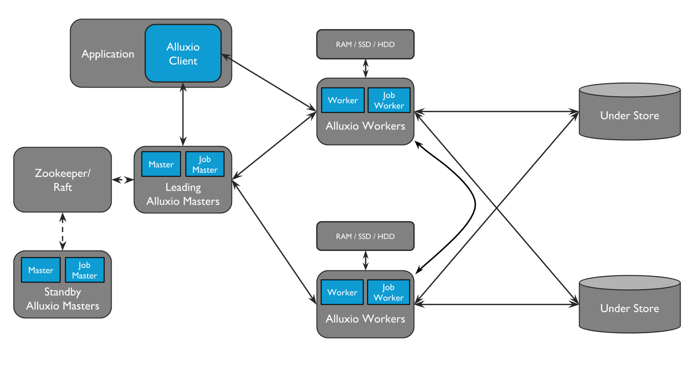
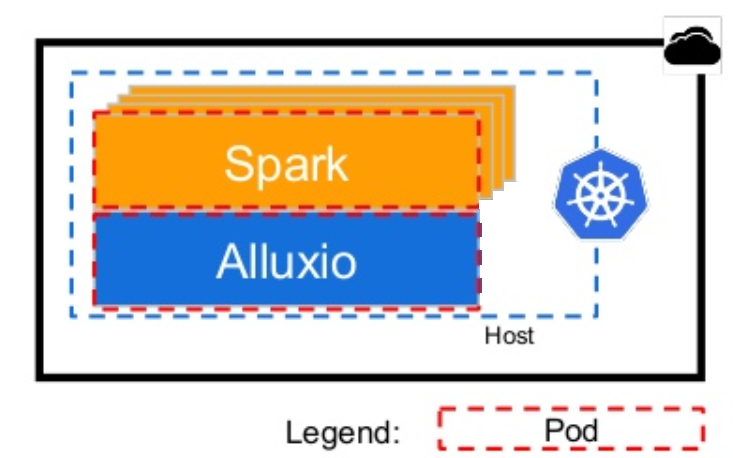
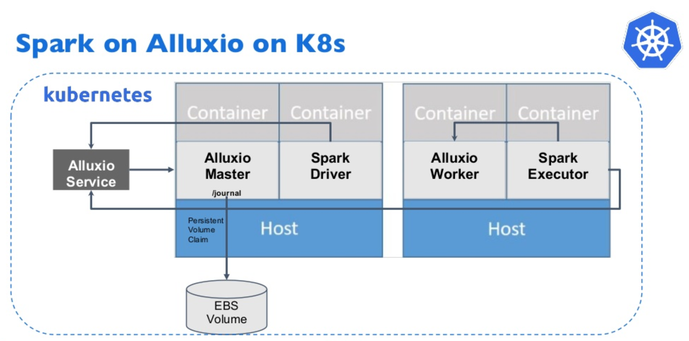
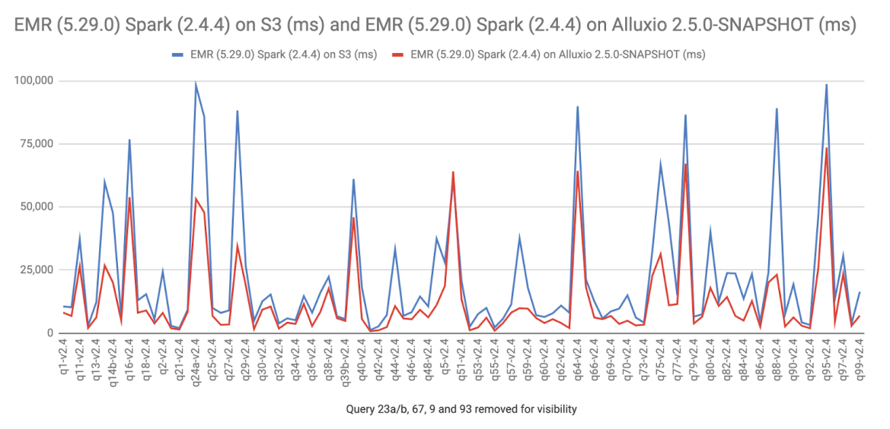

**caching\_hld**

**SequoiaDP caching layer**

\*

|                 |      |
|-----------------|------|
| Revision record |      |
| 2021-04-06      | Init |
|                 |      |

**Story编号和名称(Story Number and name)**

Story.uniondb.mgr.001联邦数据命令接口

**Story价值和功能介绍(Story value and function description)**

SequoiaDP will use an object store as its data source for its data
warehouses. Access to object stores is slow as it is across the network.
For performance, it is necessary to cache the data as close to the data
warehouses as possible. Spark caches data only for a single job. For
acceptable performance in real workloads, the cache needs data to live
much longer than a single job.

The proposed solution is to use Alluxio (formerly known as Apache
Tachyon) to provide caching of any object store for the data warehouse.

**Story 对外功能接口描述(Story external interface description)**

This caching layer will be transparent to the user. For inter-service
communication, Alluxio is 100% compatible with the S3 APIs.

**Story约束和依赖(Story restriction and dependency)**

The caching layer is dependent on the third party software Alluxio.

**Story 简单设计(Story high level design)**

**相关模块架构图(Related module architecture)**

**Alluxio general architecture**

Alluxio uses a microservice architecture with three core components:
master, worker, client. The master manages the metadata for the service.
The workers cache the data. The client handles interfacing with the
service. Each of the services will be deployed as containers in the
cluster.

Standard Alluxio deployment architecture

**SequoiaDP Alluxio deployment**

For best performance it is recommended to co-locate workers with clients
and compute – for SequoiaDP, that is the data warehouse (Spark).
SequoiaDP will deploy one Alluxio worker container on each host that
runs a Spark container and enable the short-circuit feature; this will
skip the network layer in communication between the Alluxio client and
worker.

How Spark and Alluxio will be deployed on a host

How Alluxio and Spark communicate in a Kubernetes cluster

The Alluxio client jar must be available to all Spark instances. See
<https://docs.alluxio.io/os/user/stable/en/compute/Spark.html>

According to
<https://www.alluxio.io/answers/compute/ec2-instance-ebs-disks-with-iops/>
memory will be split roughly 60% to Spark, 30% to Alluxio, 10% to OS for
large compute cloud instances. The CPU and RAM impact of co-location
requures a deeper investigation.

**Configuration notes**

SequoiaDP will read and write to storage and expect the data in the
cache to be up to date so it must use writetype CACHE\_THROUGH for
writes. Means write requests will be synchronously written to the under
store (object store) and replicated across the cluster before returning
to the client

**主要操作流程(Main operation flow)**

**相关资料设计(Related materials)**

From Alluxio's whitepaper comparing Spark performance on s3 with and
without Alluxio:

Raw query execution time for TPC-DS queries (Alluxio vs S3)

**进度评估跟踪(Progress tracking and estimation)**

\*

|                  |                                  |     |                  |                           |     |
|------------------|----------------------------------|-----|------------------|---------------------------|-----|
| 汇总信息         |                                  |     |                  |                           |     |
| 总工作量（KLOC） |                                  |     | 开发周期（人天） |                           |     |
| 开始时间         |                                  |     | 结束时间         |                           |     |
| 周计划           |                                  |     |                  |                           |     |
| 时间（第X周）    | 计划                             |     |                  | 完成情况                  |     |
| 第一周           | *编码完成Coord向Catalog注册*     |     |                  | *按时完成*                |     |
| 第二周           | *编码完成会话机制并实现全面对接* |     |                  | *延迟1天，对下阶段不影响* |     |
| 第三周           | *自测并提交测试验收*             |     |                  | *按时完成*                |     |
| 第X周            |                                  |     |                  |                           |     |

**遗留问题(Left over issues)**

说明：该特性中暂时未彻底解决或有待改进优化的问题

\*

|          |          |          |
|----------|----------|----------|
| **编号** | **标题** | **描述** |
|          |          |          |

**验收测试用例(Acceptance testcases)**

说明: 验收用例是用于表明开发基本功能OK,
满足启动测试最基本需要的一组用例.
验收用例通过,表明开发完成,可启动正式测试;

\*

<table>
<tbody>
<tr class="odd">
<td><strong>用例编号</strong></td>
<td><strong>用例名称</strong></td>
<td><strong>用例操作步骤</strong></td>
<td><strong>期望结果</strong></td>
</tr>
<tr class="even">
<td>Story.uniondb.mgr.001.001</td>
<td>创建DB2 数据源和表,查询DB2数据表</td>
<td>
添加DB2 数据源

创建表….
</td>
<td>查询结果与预期相同</td>
</tr>
<tr class="odd">
<td></td>
<td></td>
<td></td>
<td></td>
</tr>
</tbody>
</table>

**Checklist**

\*

<table>
<tbody>
<tr class="odd">
<td>检查项</td>
<td>
结论

（NA/N/Y）
</td>
<td>备注</td>
</tr>
<tr class="even">
<td>代码是否全部提交SVN，且符合代码规范</td>
<td></td>
<td></td>
</tr>
<tr class="odd">
<td>原有用例是否全部通过</td>
<td></td>
<td></td>
</tr>
<tr class="even">
<td>Story文档是否更新</td>
<td></td>
<td></td>
</tr>
<tr class="odd">
<td>验收用例是否全部通过</td>
<td></td>
<td></td>
</tr>
<tr class="even">
<td>资料是否变更</td>
<td></td>
<td></td>
</tr>
<tr class="odd">
<td>接口和设计是否通过评审</td>
<td></td>
<td></td>
</tr>
<tr class="even">
<td>相关驱动是否变更或添加</td>
<td></td>
<td></td>
</tr>
<tr class="odd">
<td>周边关联产品或模块是否通知</td>
<td></td>
<td></td>
</tr>
<tr class="even">
<td>sdb shell帮助信息是否更新</td>
<td></td>
<td></td>
</tr>
</tbody>
</table>
