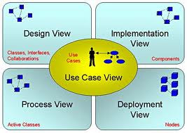
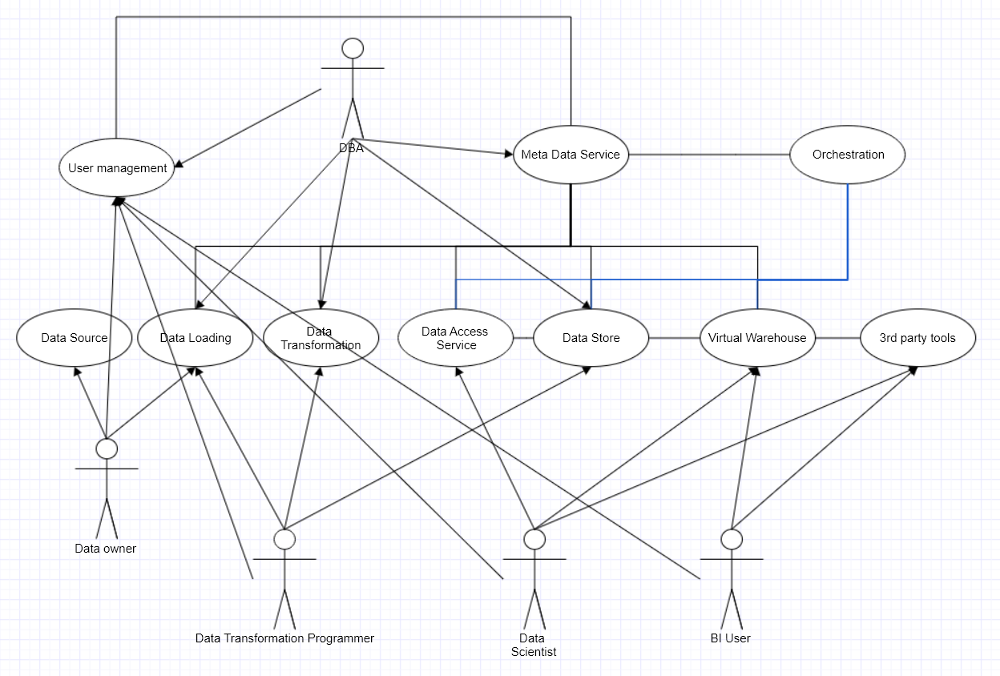
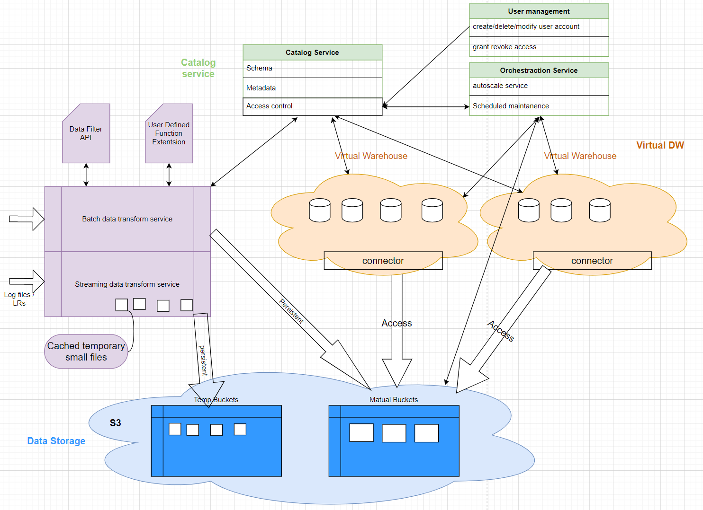
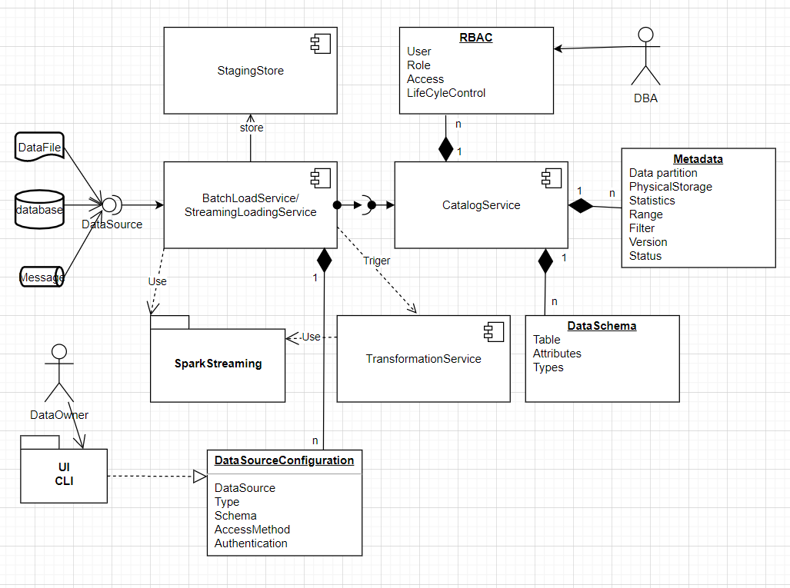
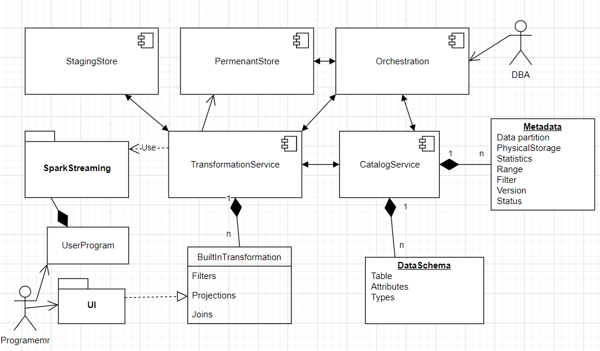
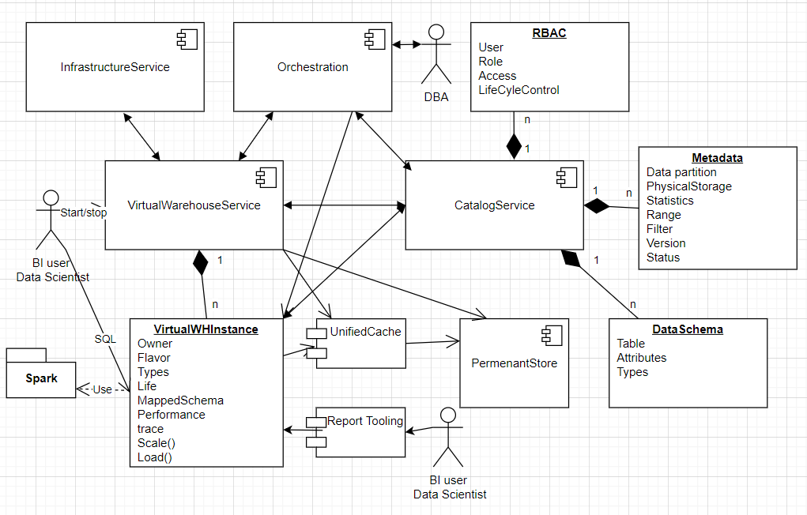
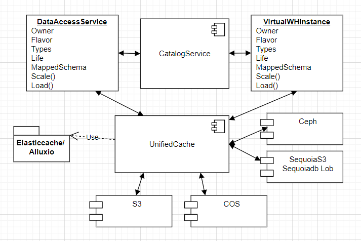
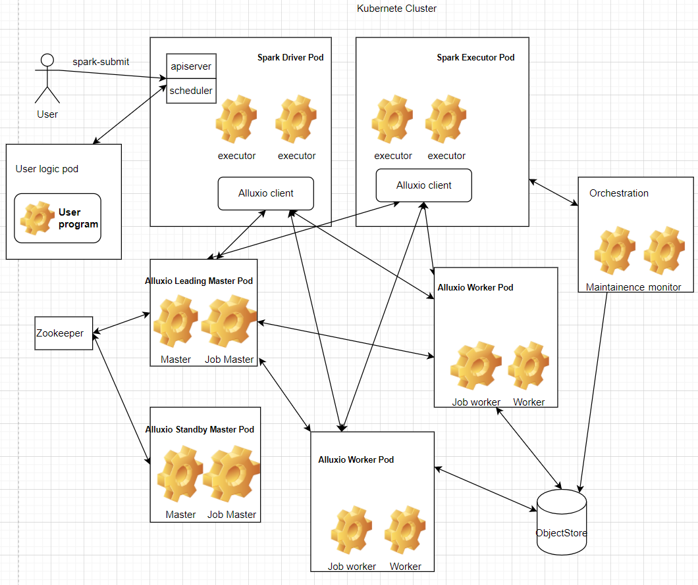
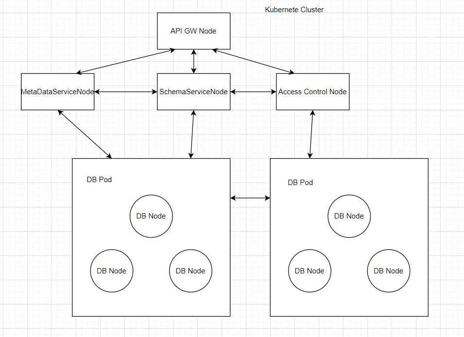

**Revision History**

|             |             |                                                             |            |
|-------------|-------------|-------------------------------------------------------------|------------|
| **Date**    | **Version** | **Description**                                             | **Author** |
| 16/Feb/2021 | 1.0 draft   | Solution External and Architecture Design Document Template | Danny Chen |
|             |             |                                                             |            |
|             |             |                                                             |            |
|             |             |                                                             |            |

 

Table of Content

1.  Introduction  2

[1.1 Purpose  2](\l)

[1.2 Scope  3](\l)

[1.3 Definitions, Acronyms and Abbreviations  3](\l)

[1.4 References  3](\l)

[2. Architectural Representation  4](\l)

[**3.  Architectural Goals and Constraints ** 4](\l)

[4.1  Actors 5](\l)

[4.2 Architecturally-Significant Use Cases  5](\l)

[**5. Logical View ** 5](\l)

[5.1 **Architecture** Overview 5](\l)

[5.2  Interface Definitions 5](\l)

[**6.  Process View ** 6](\l)

[6.1 Processes 6](\l)

[6.2 Process to Design Elements 6](\l)

[6.3 Process Model to Design Model Dependencies 6](\l)

[6.4 Processes to the Implementation 6](\l)

[**7.  Data View ** 6](\l)

[7.1 Data objects 6](\l)

[7.2 Persistence of the data 6](\l)

[7.3 Data to process mapping 6](\l)

[**8. Deployment View ** 6](\l)

[**9.   Size and Performance ** 6](\l)

[**10. Quality ** 7](\l)

###  Introduction 

This document provides a high level overview and explains the
architecture of the Sequoia Data Platform(SequoiaDP).

The document defines goals of the architecture, the use cases supported
by the system, architectural styles and components that have been
selected. The document provides a rationale for the architecture and
design decisions made from the conceptual idea to its implementation.

1.1 Purpose 
------------

This Software Architecture Document(SAD) provides a comprehensive
architectural overview and explains the architecture of the Sequoia Data
Platform, using a number of different architectural views to depict
different aspects of the system. It is intended to capture and convey
the significant architectural decisions which have been made on the
system.

In order to depict the software as accurately as possible, the structure
of this document is based on Philippe Kruchten’s “4+1” model view of
architecture \[Kruchten\].

Figure 1 view model

The “4+1” View Model allows various stakeholders to find what they need
in the software architecture.

1.2 Scope 
----------

The scope of this SAD provides an architectural overview of the Sequoia
Data Platform.

This document describes the various aspects of the SequoiaDP system
design that are considered to be architecturally significant. These
elements and behaviors are fundamental for guiding the construction of
the SequoiaDP system and for understanding this project as a whole.
Stakeholders who require a technical understanding of the SequoiaDP
system are encouraged to start by reading the Project Proposal, Concept
of Operations and Software Requirements Specification documents
developed for this system \[PP, ConOps, SRS\].

1.3 Definitions, Acronyms and Abbreviations 
--------------------------------------------

**SAD -** Software Architecture Document

**UML** – Unified Modeling Language

1.4 References 
---------------

\[PP\]: Project Proposal

\[SPMP\]: Software Project Management Plan

\[ConOps\]: Concept of Operations

\[SRS\]: Software Requirements Specification

\[Kruchten\]: The “4+1” view model of software architecture, Philippe
Kruchten, November 1995, [http://www3.software.ibm.com/ibmdl/pub/software/rational/web/whitepapers/2003/Pbk4p1.pdf](http://www3.software.ibm.com/ibmdl/pub/software/rational/web/whitepapers/2003/Pbk4p1.pdf)

 

###  Architectural Representation 

This document details the architecture using the views defined in the
“4+1” model \[Kruchten\]. The views used to document the \[xxx system\]
are:

**Use Case view**

> **Audience**: all the stakeholders of
> the system, including the end-users.
>
> **Area**: describes the set of
> scenarios and/or use cases that represent some significant, central
> functionality of the system. Describes the actors and use cases for
> the system, this view presents the needs of the user and is elaborated
> further at the design level to describe discrete flows and constraints
> in more detail. This domain vocabulary is independent of any
> processing model or representational syntax (i.e. XML).
>
> **Related Artifacts** : Use-Case Model,
> Use-Case documents

**Logical view**

> **Audience**: Designers.
>
> **Area**: Functional Requirements:
> describes the design's object model. Also describes the most important
> use-case realizations and business requirements of the system.
>
> **Related Artifacts**: Design model

**Process view**

> **Audience**: Designer, Deployment
> manager
>
> **Area**: Performance and availability:
> addresses issues of concurrency and distribution, of system’s
> integrity, of fault-tolerance, and how the main abstractions from the
> logical view fit within process architecture. A process is a group of
> tasks that form an executable unit
>
> **Related Artifacts**: Process model.

**Data view**

> **Audience**: Data specialists,
> Database administrators
>
> **Area**: Persistence: describes the
> architecturally significant persistent elements in the data model as
> well as how data flows through the system.
>
> **Related Artifacts**: Data model.

**Deployment view**

> **Audience**: Deployment managers.
>
> **Area**: Topology: describes the
> mapping of the software onto the hardware and shows the system's
> distributed aspects. Describes potential deployment structures, by
> including known and anticipated deployment scenarios in the
> architecture we allow the implementers to make certain assumptions on
> network performance, system interaction and so forth.
>
> **Related Artifacts**: Deployment
> model.

1.  ### ** ****Architectural Goals and Constraints **

    \[There are some key requirements and system constraints that have a
    significant bearing on the architecture. \]

>  

###  **Use-Case View **

The purpose of the use-case view is to give additional context
surrounding the usage of the system and the interactions between its
components. For the purposes of this document, each component is
considered a use-case actor. Section 4.1 lists the current actors and
gives a brief description of each in the overall use context of the
system. In section 4.2, the most common use-cases are outlined and
illustrated using UML use-case diagrams and sequence diagrams to clarify
the interactions between components.

4.1  Actors
-----------

**User**

The user will drive all operation of the software. No distinction is
made in regards to type of user. The user interacts with all available
interfaces to initiate and monitor all application operations

Data owner:

These users are responsible to provide access to the source of data,
determine the method to ingest or load the data to the platform, then
configure the system to execute the loading process using drag and play
UI.

Data Transformation Programmer:

The data transformation programmers will write user logic to transform
the raw data to efficient consumable data as needed. They will do this
using supported programmable plugins.

DBA

DBAs work with end data consumers to design the target data schema based
on access pattern. They have following responsibilities:

-   Defined the life cycle of the data: determine which data are
    > persistent, which data are temporary,

-   Defined the access control

-   Define the versioning and visibility of the data

-   Configure the data replication and system maintenance strategy so
    > that the data’s durability and availability satisfy business
    > requirement

Data Scientist

Data scientists use domain specific programming libraries or interfaces
to use the data from SequoiaDP

BI user

BI users will either write batch program to generate report, or use drag
and play UI to generate real time graphic report.

4.2 Architecturally-Significant Use Cases 
------------------------------------------

Figure 2: User Scenarios

4.2.1 Data batch load from source, stored in staging/temporary table

4.2.2 Data streaming load from source

4.2.3 Data transformation from row format to parquet format

4.2.4 Data BI users create virtual warehouses, tables are dynamically
mapped to data files from storage based on access control information in
meta data services. Users can run batch workload (read only)

4.2.5 Data Scientist run adhoc query through either virtual
warehouse(read write)

4.2.6 Data BI users use embedded or 3rd party tool to
generate real time graphic report

4.2.7 Based on data life cycle strategy defined by DBA, user can read
different version of data.

4.2.8 Data scientist access and analyze non-structured data through data
access service

4.2.9 DBA sets up orchestration tasks

###  **Logical View **

5.1 **Architecture** Overview
-----------------------------

The main goal of the logical view is to define the components that will
make up the system and to define the interfaces through which they will
communicate and interact with one another. The primary decision-making
factor behind defining the system components is the need to isolate the
components that are likely to change from the rest of the system. By
clearly defining the interfaces of these components and hiding their
internal implementations from the rest of the system, the impact of
expected changes can be minimized. Section 3.3 of the Software
Requirements Specification outlines the changes that are likely to be
made to the system. A summary of these changes and how the logical
decomposition of the architecture addresses them is as follows:

> 
>
> Figure 3 Logic architecture
>
>  

5.2  Interface Definitions
--------------------------

**TBD**

### ** Process View **

A description of the process view of the architecture. Describes the
tasks (processes and threads) involved in the system's execution, their
interactions and configurations. Also describes the creation of certain
objects .

6.1 Processes
-------------

#### 6.1.1 Load

Figure 4 Load process

Users use UI to generate DataSourceConfiguration, which contain
datasource information, type of source, dataschema, AccessMethod and
Authentication to the source.

BatchLoadService/StreamingLoadService connect to DataSource using the
AccessMethod and Authentication provided by DataSourceConfiguration.
Update CatalogService on the DataSchema and Metadata. Stores the loaded
data in StagingStore. On loading success, it triggers the start of next
service: TransformationService. BatchLoadService/StreamingLoadService
uses SparkStreaming as the underneath platform.

DataSource provides interface to DataFiles, MessageQueue or Database

CatalogService owns and provides APIs to access to DataSchema, Metadata
and RBAC.

#### 6.1.2 Transformation 

Figure 5 Transformation

TransformationService uses SparkStreaming as the underneath platform. It
supports programming APIs (Java, Python, Scala) through sparkstreaming.
It can also support simple transformation customization using drag and
drop UI. It persistent data to StagingStore and PermenantStore as
needed. It updates Metadata and schema information in CatalogService.

Orchestration provides event, trigger and workload scheduling
customization for TransformationService. It also triggers background
data maintenance job.

#### 6.1.3 Virtual Warehouse

Figure 6 Virtual Warehouse

User access VirtualWarehouseService to start or stop new
VirtualWHInstance. Then use SQL to write program to access
VirtualWHInstance. VirtualWarehouseService communicates with
InfrastructureService to acquire resource to run VirtualWHInstance.

InfrastructureService is an abstraction of IaaS from private cloud or
public cloud.

VirtualWHInstance is built based on a spark cluster. It may have
different flavors depending on the configuration. The UnifiedCache is
deployed when the first VirtualWHInstance is started.

Orchestraction monitors load() from VirtualWHInstance, triggers Scale()
to guarantee QOS as needed

RBAC service provide access control for table mappings, row level
visibility and user authentication in each virtual warehouse, it also
provides user level access control on raw objects in storage.

#### 6.1.4 Storage

Figure 7 Storage

UnifiedCache provides a caching service for any raw data or intermediate
data cache and access. Underneath it uses Alluxio package. It provide a
abstraction of the persistence storage which can be either private
deployment or cloud object store.

6.2 Process to Design Elements
------------------------------

6.3 Process Model to Design Model Dependencies
----------------------------------------------

6.4 Processes to the Implementation
-----------------------------------

### ** Data View **

A description of data model of the architecture. Describes how external
data are managed by the system, as well as the life cycle of the
internal data. It also describes how the data are used by the tasks.

7.1 Data objects
----------------

#### 7.1.1 DataSourceConfiguration

#### 7.1.2 StagingData and messages in the pipe 

#### 7.1.3 PermenantData

#### 7.1.4 Schema

#### 7.1.5 MetaData

#### 7.1.6 AccessControlData

#### 7.1.7 VirtualInstanceMetaData

7.1.8 PrebuiltData (Cube)

7.1.9 CachedResult (for reuse)

7.1.10 DataSharing (View)

7.2 Persistence of the data
---------------------------

7.3 Data to process mapping
---------------------------

###  **Deployment View **

A description of the deployment view of the architecture Describes the
various physical nodes for the most typical platform configurations.
Also describes the allocation of tasks (from the Process View) to the
physical nodes.

1.  Virtual Warehouse Instance and Data ingestion service deployment

    

    Figure 8 virtual warehouse instance deployment

    Both virtual house service and data ingestion service are based on
    spark, their deployments are very similar. Only difference is the
    extra user logic specific pod in data ingestion .

    Spark deployment is managed by Kubernet cluster. Spark executors are
    running containers within the spark pod. Kubernet provides work load
    monitoring and support dynamic scaling by adding or removing the
    number of executors. Each spark pod is deployed with AlluxioClient
    for data caching/access.

    Alluxio cluster is also jointly deployed and managed under the same
    Kubernet cluster. This cluster is consist with Master Pod and worker
    pod.

2.  Catalog service deployment

    

3.  Data ingestion service deployment

### ** ****Size and Performance **

The chosen software architecture supports the key sizing and timing
requirements, as stipulated in the following Supplementary
Specification:

The base performance analysis of TPC-H and TPC-DS will be done on out of
box Spark with following variance:

1.  Spark using Parquet file storage in cloud storage (S3) : baseline 1

2.  Spark using Parquet file using HDFS: baseline 2

3.  Spark with Delta engine+Delta lake + storage in S3: baseline 3
    (optional)

4.  SequoiaDP performance run with Parquet micro-partition on cloud
    storage: perf run 1

5.  SequoiaDB performance run with Parquet micro-partition on local
    object store: perf run 2

With same system configuration:

SequoiaDP perf run 1 result should exceed baseline 1, should be close or
exceed baseline 2.

SequoiaDP perf run 2 result should exceed baseline 1, should be the same
or exceed baseline 2

Further performance enhancement maybe done accordingly based on baseline
performance analysis.

### **Quality **

The software architecture supports the quality requirements.
