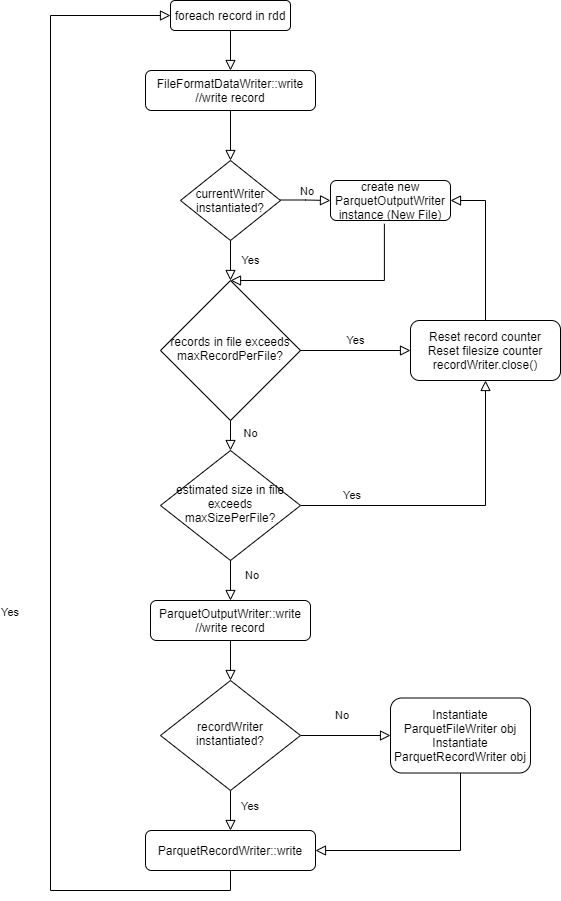

**story - mp support**

**xxxxx**

\*

|                 |      |
|-----------------|------|
| Revision record |      |
| 2021-04-22      | Init |
|                 |      |

**Story编号和名称(Story Number and name)**

SequoiaDP micropartition support

**Story价值和功能介绍(Story value and function description)**

说明: 简单描述Story
对于客户的价值,使用客户(如应用程序开发人员/维护人员,或者内部技术服务人员)

Having micropartitions will allow us to limit the actual size of
physical data file. When a file is limited to 50 to 100mb, it has been
proven to be beneficial when these data are in a network storage.

In addition, UPDATEs in delta table is done via updating relevant
records in the parquet files and writing a new version of these parquet
files. In another word Delta is not doing in-place updates. When the
ratio (size of records to be updated):(parquet file size) is low, the
cost overhead of copying existing records becomes higher. For this
reason it will be beneficial to put a limit on the file size.

**Story 对外功能接口描述(Story external interface description)**

说明: 简单描述Story 的对外接口,包括命令行/界面,
客户可见配置文件的参数描述;

A new spark config will be introduced

&lt;name&gt;spark.sql.files.sizePerFile&lt;/name&gt;

&lt;description&gt;Estimated number of bytes to pack into a single file
when writing files&lt;/description&gt;

&lt;default&gt;0&lt;/default&gt; // disabled

**Story约束和依赖(Story restriction and dependency)**

Due to the separation of Spark processing engine and its underneath
storage library, Spark is not aware of the actual record size that is
written out to disk. Therefore an estimate will be computed based on the
raw record size and the compression algorithm used.

Only Snappy is supported for now as it is the default algorithm used by
Parquet.

**Story 简单设计(Story high level design)**

The main consideration for this story is that during a batch
insert/load, where each Spark task will write out data that is greater
than spark.sql.files.sizePerFile, we will try to split the data such
that each file is roughly spark.sql.files.sizePerFile bytes.

Currently Spark supports a config to limit the number of records in a
file - spark.sql.files.maxRecordsPerFile. The way this is implemented is
incrementing a record counter each time a row is written out to the
underlying data format. When the threshold is reached, it closes the
current file writer and create a new file writer for subsequent rows. If
we follow this approach to implement micropartition, the flow will be
similar to figure 1.

Figure 1 - Augmenting current Spark flow to include threshold on
micropartiton size.

Note that as part of the Spark architecture, from Spark executor’s side
it is aware of the output format and the compression codec being used.
In addition it can compute an estimation of the raw record size.
However, in terms of the actual size that is written out to disk, that
is up to the file format’s output writer.

The separation of the Spark execution engine and the various storage
implementation make it non-feasible for Spark to know the actual record
size written. Therefore the option proposed from figure 1 is to estimate
the final record size based on the raw size and the codec’s documented
compression ratio. The advantage of this design is it will be consistent
with existing Spark’s code flow of similar file constraint -
maxRecordsPerFile. The code changes for this will also be trivial and
thus less risky than the alternative option (to be discussed later).
However the disadvantage of this option is that it carries the risk
where the estimation can be very off from the actual row record on disk
when compression is on. The reason is that, even though we know the
approximate codec algorithm’s compression ratio, there is still the
variable on the actual dataset itself. For example, the documented
compression ratio for Snappy is between 1.5x to 1.7x on plain text,
however when the dataset content is very repetitive (such as the dbgen
tool used to generate dataset for tpcds/tpch), we observed the
compression ratio reaching 5x.

The alternative option is to keep track of file size increments from the
storage side. This approaches requires a few prerequisite:

Storage side needs to know what the file limit is. Traditionally each
storage format has its own set of configs. For ex. Parquet library has
spark.hadoop.parquet.\*. Orc has spark.hadoop.orc.\*. This means we will
need a new config for each supported format.

The storage side needs to provide a way to return the file size
information to Spark. Currently the information flow during writes is
very one-way (Spark to storage). So to introduce APIs for Spark to
consume will require hacking into existing ‘write’ interfaces to ‘read’
information from storage.

Alternatively, the storage implementation of the write APIs can throw a
new FileSizeExceedException back to Spark executor, and Spark executor
can handle this exception by creating a new outputWriter instance.
However this would be considered poor practice of modifying existing
APIs and using Exceptions to control code flows (similar to goto in C++)

**进度评估跟踪(Progress tracking and estimation)**

\*

|                  |                                  |     |                  |                           |     |
|------------------|----------------------------------|-----|------------------|---------------------------|-----|
| 汇总信息         |                                  |     |                  |                           |     |
| 总工作量（KLOC） |                                  |     | 开发周期（人天） |                           |     |
| 开始时间         |                                  |     | 结束时间         |                           |     |
| 周计划           |                                  |     |                  |                           |     |
| 时间（第X周）    | 计划                             |     |                  | 完成情况                  |     |
| 第一周           | *编码完成Coord向Catalog注册*     |     |                  | *按时完成*                |     |
| 第二周           | *编码完成会话机制并实现全面对接* |     |                  | *延迟1天，对下阶段不影响* |     |
| 第三周           | *自测并提交测试验收*             |     |                  | *按时完成*                |     |
| 第X周            |                                  |     |                  |                           |     |

**遗留问题(Left over issues)**

说明：该特性中暂时未彻底解决或有待改进优化的问题

\*

|          |          |          |
|----------|----------|----------|
| **编号** | **标题** | **描述** |
|          |          |          |

**验收测试用例(Acceptance testcases)**

说明: 验收用例是用于表明开发基本功能OK,
满足启动测试最基本需要的一组用例.
验收用例通过,表明开发完成,可启动正式测试;

\*

<table>
<tbody>
<tr class="odd">
<td><strong>用例编号</strong></td>
<td><strong>用例名称</strong></td>
<td><strong>用例操作步骤</strong></td>
<td><strong>期望结果</strong></td>
</tr>
<tr class="even">
<td>Story.uniondb.mgr.001.001</td>
<td>创建DB2 数据源和表,查询DB2数据表</td>
<td>
<strong>添加DB2 数据源</strong>

<strong>创建表….</strong>
</td>
<td>查询结果与预期相同</td>
</tr>
<tr class="odd">
<td></td>
<td></td>
<td></td>
<td></td>
</tr>
</tbody>
</table>

**Checklist**

\*

<table>
<tbody>
<tr class="odd">
<td>检查项</td>
<td>
结论

（NA/N/Y）
</td>
<td>备注</td>
</tr>
<tr class="even">
<td>代码是否全部提交SVN，且符合代码规范</td>
<td></td>
<td></td>
</tr>
<tr class="odd">
<td>原有用例是否全部通过</td>
<td></td>
<td></td>
</tr>
<tr class="even">
<td>Story文档是否更新</td>
<td></td>
<td></td>
</tr>
<tr class="odd">
<td>验收用例是否全部通过</td>
<td></td>
<td></td>
</tr>
<tr class="even">
<td>资料是否变更</td>
<td></td>
<td></td>
</tr>
<tr class="odd">
<td>接口和设计是否通过评审</td>
<td></td>
<td></td>
</tr>
<tr class="even">
<td>相关驱动是否变更或添加</td>
<td></td>
<td></td>
</tr>
<tr class="odd">
<td>周边关联产品或模块是否通知</td>
<td></td>
<td></td>
</tr>
<tr class="even">
<td>sdb shell帮助信息是否更新</td>
<td></td>
<td></td>
</tr>
</tbody>
</table>
