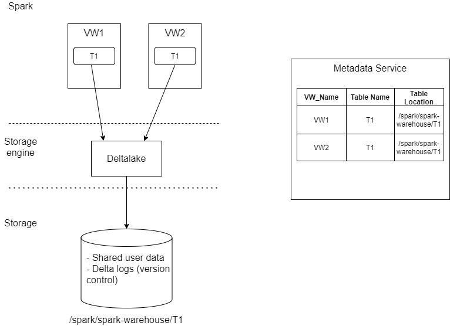
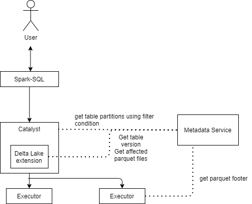

**story - transaction support**

**xxxxx**

\*

|                 |      |
|-----------------|------|
| Revision record |      |
| 2021-04-06      | Init |
|                 |      |

**Story编号和名称(Story Number and name)**

Cross transactional support for multi virtual warehouse

**Story价值和功能介绍(Story value and function description)**

说明: 简单描述Story
对于客户的价值,使用客户(如应用程序开发人员/维护人员,或者内部技术服务人员)

Multiple virtual warehouses will be allowed to shared the same physical
data. Each virtual warehouse can write to this same data resource
without causing inconsistent/corrupted data.

**Story 对外功能接口描述(Story external interface description)**

说明: 简单描述Story 的对外接口,包括命令行/界面,
客户可见配置文件的参数描述;

**Story约束和依赖(Story restriction and dependency)**

To have cross VW transaction support, the data must be stored using
delta format.

Applications need to resubmit their jobs in the event that there are
conflicts in transactions.

**Story 简单设计(Story high level design)**

**相关模块架构图(Related module architecture)**

Delta logs are a collection of json files detailing changes of the
table’s content. Each version of a table is represented by a log file.
With the log files, along with not using in-placed update, users can
query consistent data since each query is associated with a table
version.

Delta Lake supports serializable isolation using optimistic concurrency
control. Validation is done at commit time to check for conflicts. This
check is done without dependency from the VW where the query is executed
from, which is how cross-VW transaction can be achieved. An exception is
thrown if conflicts are detected, and it is up to applications to
re-submit their job.

With Delta Lake’s concurrency control, applications proceed with the
following sequence

Read (if needed) the latest available version of the table to identify
which files need to be modified (that is, rewritten).

Write: Stages all the changes by writing new data files.

Validate and commit: Before committing the changes, checks whether the
proposed changes conflict with any other changes that may have been
concurrently committed since the snapshot that was read. If there are no
conflicts, all the staged changes are committed as a new versioned
snapshot, and the write operation succeeds. However, if there are
conflicts, the write operation fails with a concurrent modification
exception rather than corrupting the table as would happen with the
write operation on a Parquet table.

From experiments, it appears that readers could be blocked when there is
a write commit happening. Speculation is that the reader sees a new
version log file being written but does not have full access to it due
to ongoing commit. We can consider extending Delta Lake to use the SDP
metadata service to query for latest table version instead of relying on
log files. Here are several places where Spark/DeltaLake could use the
SDP metadata services

Limitation

Under this model, dropping a table from one VW could affect another VW
that shares the same underlying storage location. More careful
consideration will need to be put into this area.

The same for removing a VW - should it drop all the tables or simply the
metadata? What will be the trigger to remove the physical storage if
only the metadata is removed.

**主要操作流程(Main operation flow)**

**相关资料设计(Related materials)**

**Operations that can/cannot cause conflicts in Delta Lake**

\*

|                                |                 |                                |                |
|--------------------------------|-----------------|--------------------------------|----------------|
| ** **                          | **INSERT**      | **UPDATE, DELETE, MERGE INTO** | **COMPACTION** |
| **INSERT**                     | Cannot conflict |                                |                |
| **UPDATE, DELETE, MERGE INTO** | Can conflict    | Can conflict                   |                |
| **COMPACTION**                 | Cannot conflict | Can conflict                   | Can conflict   |

**进度评估跟踪(Progress tracking and estimation)**

\*

|                  |                                  |     |                  |                           |     |
|------------------|----------------------------------|-----|------------------|---------------------------|-----|
| 汇总信息         |                                  |     |                  |                           |     |
| 总工作量（KLOC） |                                  |     | 开发周期（人天） |                           |     |
| 开始时间         |                                  |     | 结束时间         |                           |     |
| 周计划           |                                  |     |                  |                           |     |
| 时间（第X周）    | 计划                             |     |                  | 完成情况                  |     |
| 第一周           | *编码完成Coord向Catalog注册*     |     |                  | *按时完成*                |     |
| 第二周           | *编码完成会话机制并实现全面对接* |     |                  | *延迟1天，对下阶段不影响* |     |
| 第三周           | *自测并提交测试验收*             |     |                  | *按时完成*                |     |
| 第X周            |                                  |     |                  |                           |     |

**遗留问题(Left over issues)**

说明：该特性中暂时未彻底解决或有待改进优化的问题

\*

|          |          |          |
|----------|----------|----------|
| **编号** | **标题** | **描述** |
|          |          |          |

**验收测试用例(Acceptance testcases)**

说明: 验收用例是用于表明开发基本功能OK,
满足启动测试最基本需要的一组用例.
验收用例通过,表明开发完成,可启动正式测试;

\*

<table>
<tbody>
<tr class="odd">
<td><strong>用例编号</strong></td>
<td><strong>用例名称</strong></td>
<td><strong>用例操作步骤</strong></td>
<td><strong>期望结果</strong></td>
</tr>
<tr class="even">
<td>Story.uniondb.mgr.001.001</td>
<td>创建DB2 数据源和表,查询DB2数据表</td>
<td>
<strong>添加DB2 数据源</strong>

<strong>创建表….</strong>
</td>
<td>查询结果与预期相同</td>
</tr>
<tr class="odd">
<td></td>
<td></td>
<td></td>
<td></td>
</tr>
</tbody>
</table>

**Checklist**

\*

<table>
<tbody>
<tr class="odd">
<td>检查项</td>
<td>
结论

（NA/N/Y）
</td>
<td>备注</td>
</tr>
<tr class="even">
<td>代码是否全部提交SVN，且符合代码规范</td>
<td></td>
<td></td>
</tr>
<tr class="odd">
<td>原有用例是否全部通过</td>
<td></td>
<td></td>
</tr>
<tr class="even">
<td>Story文档是否更新</td>
<td></td>
<td></td>
</tr>
<tr class="odd">
<td>验收用例是否全部通过</td>
<td></td>
<td></td>
</tr>
<tr class="even">
<td>资料是否变更</td>
<td></td>
<td></td>
</tr>
<tr class="odd">
<td>接口和设计是否通过评审</td>
<td></td>
<td></td>
</tr>
<tr class="even">
<td>相关驱动是否变更或添加</td>
<td></td>
<td></td>
</tr>
<tr class="odd">
<td>周边关联产品或模块是否通知</td>
<td></td>
<td></td>
</tr>
<tr class="even">
<td>sdb shell帮助信息是否更新</td>
<td></td>
<td></td>
</tr>
</tbody>
</table>
